# 🛍️ Joyería Online - E-commerce  

 **Joyeria Marly** - Nuestro proyecto consiste en el desarrollo de una app web para Marly Handmade Jewelry, con el objetivo de modernizar la gestión de ventas y administración, además de mejorar la experiencia del cliente. 
Esta plataforma permitirá optimizar procesos, que ayudará a la joyería a crecer en el mundo digital y llegar a más personas


### Requerimientos funcionales
El aplicativo web debe permitir al usuario 
-	poder registrarse e ingresar a su cuenta
-	visualizar el catálogo de productos
-	visualizar los términos y condiciones
-	realizar un reclamo
-	tener acceso al carrito de compras
-	realizar una compra
-	descargar la boleta de su compra
El aplicativo web debe permitir al administrador 
-	eliminar/agregar/editar productos
-	eliminar/editar clientes
-	editar estado del reclamo
-	Visualizar listado de clientes/productos/compras/reclamos

 ### Requerimientos no funcionales
-	Usabilidad → que sea intuitiva y fácil de usar.
-	Compatibilidad → adaptable a distintos dispositivos.
-	Seguridad → protección de datos y transacciones.
-	Rendimiento → páginas que carguen rápido.
-	Escalabilidad → lista para crecer con nuevas funciones.

---

## 🚀 Tecnologías utilizadas  

### Backend  
- **Spring Boot** (Java) – Framework principal para la lógica de negocio y APIs REST.  
- **IntelliJ IDEA** – IDE de desarrollo.  
- **MySQL** – Base de datos relacional para almacenamiento de información.  

### Frontend  
- **Vite + React** – Framework moderno para el desarrollo de la interfaz de usuario.  
- **CSS/Tailwind** – Estilos y diseño responsivo.  

---

## 📦 Instalación y ejecución  

### Backend (Spring Boot)  
```bash
# Clonar repositorio
git clone https://github.com/MaryenAguilar/Herramientas-De-Desarrollo.git

# Entrar al proyecto backend
cd backend

# Compilar y ejecutar
./mvnw spring-boot:run
```

### Frontend (React + Vite)
```bash
# Entrar al proyecto frontend
cd Herramientas-De-Desarrollo

# Instalar dependencias
npm install

# Ejecutar en entorno local
npm run dev
```

### Base de datos (MySQL)
- Crear una base de datos llamada joyeriaBD.
- Ejecutar el script SQL de creación de tablas (disponible en /db).
- Configurar credenciales en application.properties de Spring Boot.

```bash
spring.datasource.url=jdbc:mysql://localhost:3306/joyeriaBD
spring.datasource.username=root
spring.datasource.password=root
spring.jpa.hibernate.ddl-auto=update
```

## 👥 Roles y Créditos
| Nombre | Rol | Funciones |
|--------|-----|-----------|
| Edson | Dev FullStack | Productos |
| Giancarlo | Dev FullStack | Login y Registro |
| Maryen | Git Master y Dev FullStack | Control de versiones |
| Nayeli | Dev FullStack | Reclamos |
| Anthony | Dev FullStack | Base de Datos |

## 👥 Roles del sistema  

### Cliente  
- Registrar un usuario nuevo
- Ver productos disponibles
- Agregar/quitar productos del carrito
- Visualizar el total de compra
- Realizar una compra
- Descargar la boleta de compra
- Realizar un reclamo.
- Visualizar los términos y condiciones

### Administrador  
- Gestionar clientes (visualizar, editar, eliminar, buscar por DNI).  
- Gestionar productos (visualizar, agregar, modificar, eliminar, buscar por código).  
- Visualizar ventas realizadas y acceder a boletas.  
- Visualizar y editar productos.  
- Consultar pedidos por cliente (DNI o código de venta).   

---

## 📂 Arquitectura  

El proyecto sigue el **patrón de diseño MVC (Modelo - Vista - Controlador)**:  
- **Modelo**: Entidades como Producto, Pedido, Venta, Usuario, etc.  
- **Vista**: Interfaz desarrollada con React + Vite.  
- **Controlador**: Endpoints REST con Spring Boot.  

---

## 🗄️ Base de datos  

Se implementó en **MySQL**, con tablas principales como:  
- `Usuario`, `Roles`  , `Usuario_Rol`  
- `Producto`, `CategoriaProducto`, `Material`, `Coleccion`  
- `Pedido`, `DetallePedido`, `EstadoPedido`  
- `Venta`, `Boleta`

---

## 🔄 Flujo de Trabajo en Git
### Estructura de ramas: 
Rama feature: 
Se usa cuando necesitas desarrollar una nueva funcionalidad para el proyecto.\
Rama fix: Se usa cuando detectas un bug o error en el código existente y necesitas solucionarlo.
### Comandos en Git:
- Con `git init` se inicia un nuevo repositorio, luego con `git clone <url-del-repositorio>` se copia un proyecto existente en la máquina local, y finalmente con `git config user.name "Tu Nombre"` y `git config user.email "tu_email@example.com"` se define la identidad del programador que quedará registrada en los commits del proyecto.
  ```bash
  git init
  git clone "Link del proyecto"
  git config --global user.name "Nombre"
  git config --global user.email "Correo"
<p align="center">
  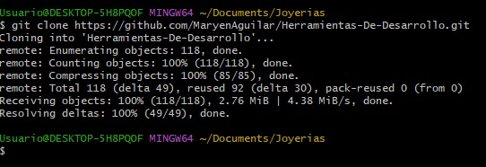
</p>

- Se implementó touch/mkdir para crear los archivos que contengan el LICENSE, .gitignore, README y la carpeta de screenshots. 
  ```bash
  touch .gitignore
  touch LICENSE
  touch README.MD
  mkdir "NombreCarpeta"
<p align="center">
  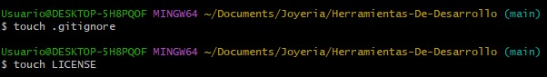
  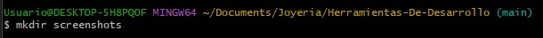
</p>

- Se usó el comando add para seleccionar los cambios realizados y mandarlos a Stage, para posteriormente realizar un commit. También, podemos modificar los commits realizados o visualizar todo el listado de commits previos. Finalmente, usamos status para mostrar el estado del repositorio: archivos modificados, en Stage y sin seguimiento.
  ```bash
  git add .
  git commit -m "Mensaje"
  git commit --amend -m "Mensaje"
  git log --oneline
  git status
<p align="center">
  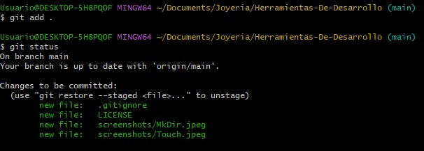
  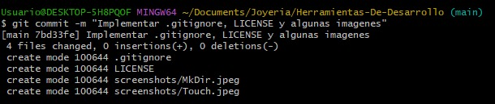
</p>

- Se implementó git push y git pull para sincronizar el repositorio local con el repositorio remoto, permitiendo subir los cambios realizados localmente (push) y obtener las actualizaciones realizadas por otros colaboradores (pull). Esto garantiza que el equipo trabaje siempre con la versión más reciente del código y evita conflictos durante el desarrollo colaborativo. 
  ```bash
  git push origin "Rama"
  git pull origin "Rama"
<p align="center">
  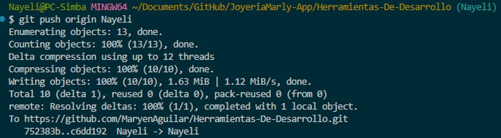
  
</p>

- En Git, una rama (branch) es una línea de desarrollo independiente dentro de un repositorio. Usando el comando branch se pueden crear ramas nuevas. Además, Con el comando switch se puede cambiar de una rama a otra fácilmente. También, utilizamos --no-merged para visualizar las ramas no unidas al main. Por ultimo, checkout -b seria otra opción para crear y cambiar a la rama nueva, evitando usar dos lineas como branch y switch. 
  ```bash
  git branch "Rama"
  git switch "Rama"
  git branch --no-merged
  git branch -d "Rama"
  git checkout -b "Rama"
<p align="center">
  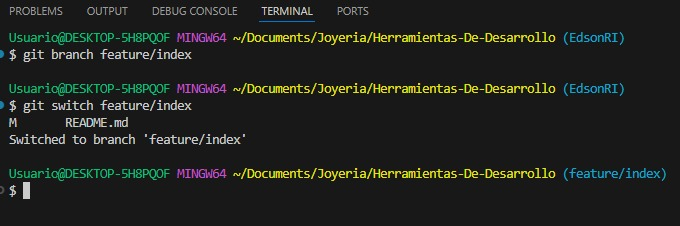
</p>

- En Git, reflog guarda un registro de todos los movimientos en el repositorio, incluso los que no aparecen en el historial de commits, y sirve para recuperar cambios perdidos. Por otro lado, git merge se usa para combinar el trabajo de una rama con otra, uniendo sus cambios en una sola línea de desarrollo
  ```bash
  git reflog
  git merge "Rama"
<p align="center">
  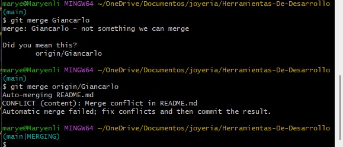
</p>

### Pull Request/Merge Request:
Un Pull Request es una solicitud que haces en plataformas como GitHub o GitLab para pedir que los cambios de tu rama se integren en otra (normalmente en main o develop).
Un Merge Request es lo mismo que un Pull Request, pero con el nombre usado en GitLab. Utilizamos Pull Request para pedir un merge de los cambios realizados en una rama hacia el Main, todos los colaboradores pueden verificar y confirmar el Merge.
<p align="center">
  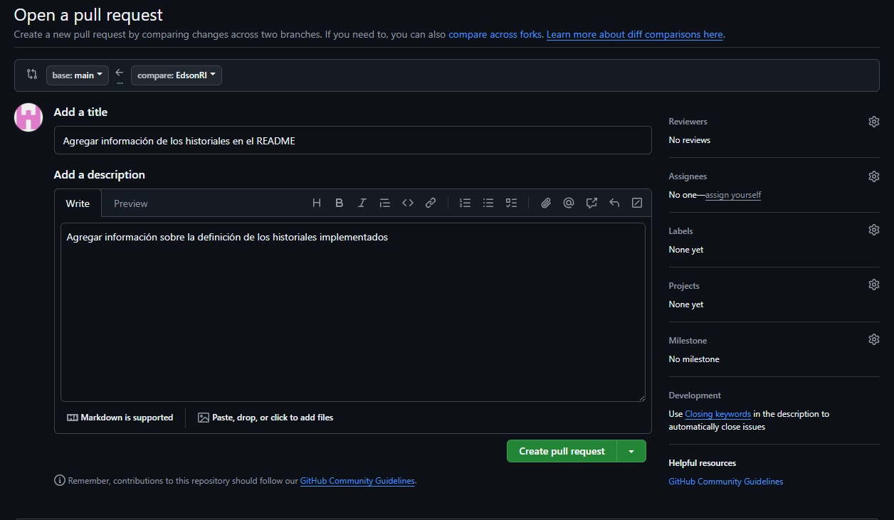
  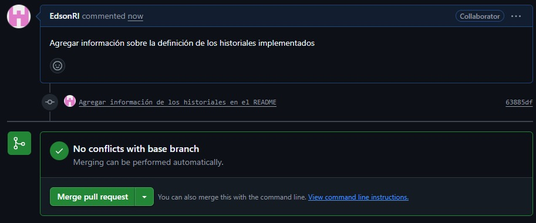  
  
  
</p>

### Resolución de problemas: 
Durante el desarrollo, surgió un conflicto de merge porque dos ramas diferentes habían modificado el archivo README.md en las mismas secciones.
- En una rama, se habían agregado instrucciones con la ruta del repositorio MaryenAguilar/Herramientas-De-Desarrollo.
- En la otra, se usaba el repositorio nayy123/JoyeriaMarly-App y nombres de carpetas distintas para el frontend.
Al intentar unir ambas ramas con git merge, Git detectó que no podía decidir automáticamente qué cambios mantener, por lo que marcó las líneas en conflicto dentro del archivo.
Solución:
1. Se revisaron manualmente las diferencias en el archivo marcado por Git.
2. Se eligieron y combinaron las partes correctas de cada versión (repositorio, carpetas y credenciales).
3. Finalmente, se guardó el archivo corregido, se usó:
  git add README.md
  git commit
para confirmar la resolución.
De esta forma, el repositorio quedó actualizado y sin conflictos, manteniendo una sola versión consolidada del README.md.
<p align="center">
  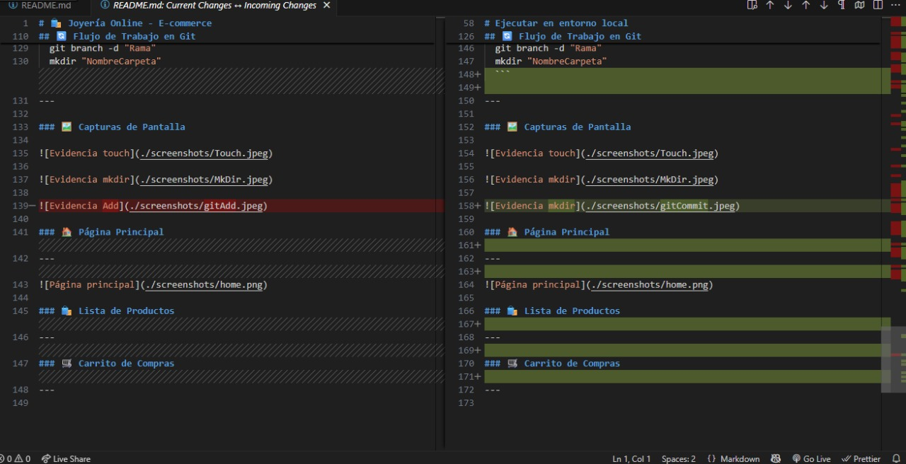
  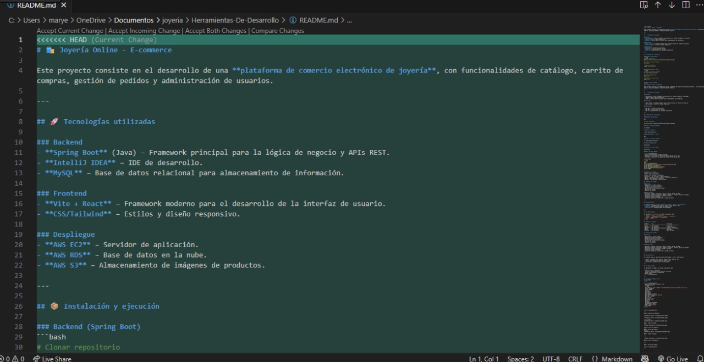  
</p>

### Historial de puntos de control: 
En Git, los puntos de control o checkpoints son todos los commits realizados hasta el momento.
<p align="center">
  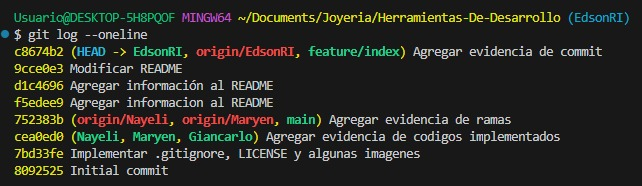
</p>

### Historial de HEAD:
En Git, la cabecera o HEAD es un puntero especial que indica en qué commit estás trabajando actualmente.

<p align="center">
  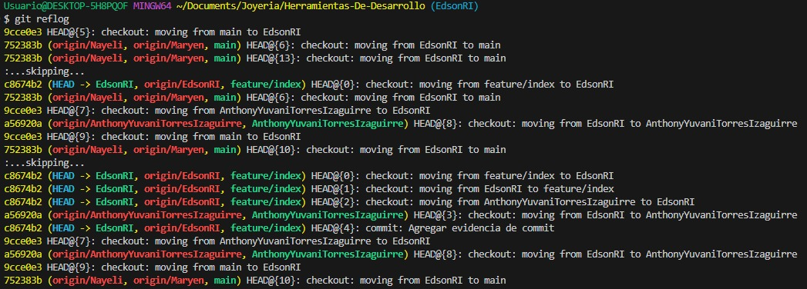
</p>

### 🖼️ Capturas de Pantalla
---

### 🏠 Pantalla Principal
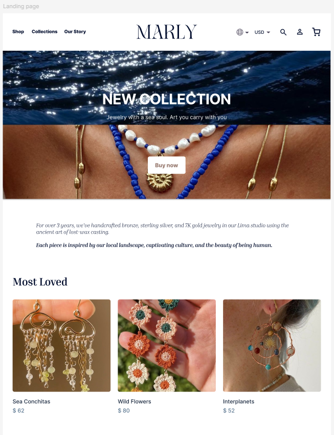
---

### Pagina Login
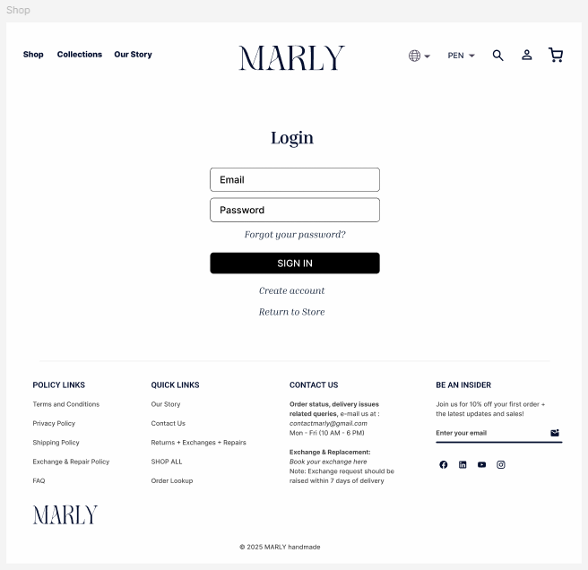
---

### 🛍️ Lista de Productos

---

### Página de Nosotros
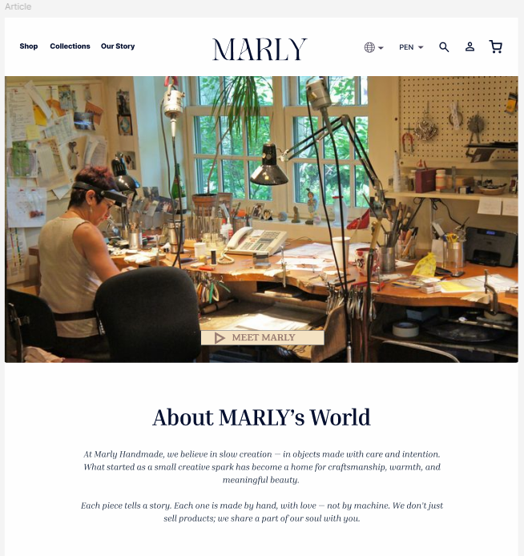
---

### Página de Reclamos/Términos y condiciones
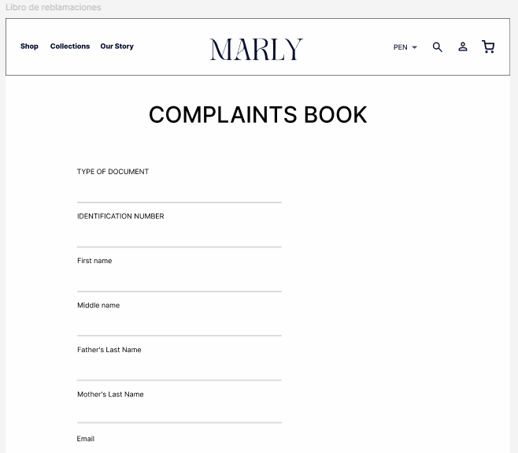
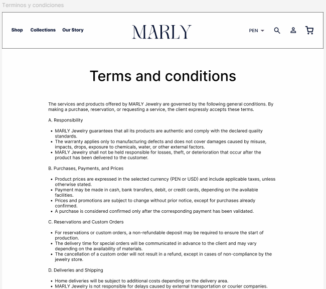
---